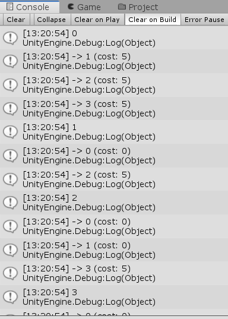

# Report

## Implementation Notes

- [ ] Git Log: See log.txt

* Crowd Simulator

  * [x] Select Agent with left click: (**Modification for multi-selection and partial selection**: Our selection is using **Left Control + Click** to select multiple agents or obstacles)
  * [x] Agenet Navigate using mouse's right click: (**Modification**: Our navigation is, when there are agents being selected, using **Mouse Click** to navigate desired position)
  * [x] Obstacle Movement: Green obstacle will move automatically, **purple** obstacle is moved by **selected by Left Ctrl + Click** and **moved by Arrow Key**.
  * [x] Camera Control: WASD, Space (Higher) and Shift (Lower), and JKL to tilt and pan, Mouse scroll to zoom

* Environment Elements

  

  * Using Stairs to connect the disjoint levels, with stairs set as off-mesh links
  * Left Bottom room is the simple maze with bottleneck areas
  * Different obstacles:
    * **Purple**: NavMesh Obstacle, controllable with **Left Ctrl + Click** to multi-select and use **arrow key** to move
    * **Green**: NavMesh Obstacle which is moving automatically along specific waypoints

- [x] Bake a NavMesh: We changed our method from the normal static baking to [Dynamic NavMesh baking]( https://github.com/Unity-Technologies/NavMeshComponents). It support building NavMesh dynamically during runtime, so that the cut-mesh of the moving obstacle is updated. 
- [x] Dynamic Obstacles: Green rectangular are moving without controls.
- [x] Weighted Planes: 
  * Red: Rough Plane to get avoid of
  * Green: Preferred smooth plane
  * Brown: Normal walkable area

## Controls

* For Agent: Left Control + Click to select agents (Red capsule or Orange hexagon (the adversarial agent)), and then left click on the map to direct to goal position (Default is the coin on the bottom right corner)
* For Obstacles: Left Control + Click to select purple obstacles, and the use arrow keys to move
* For Camera: WASD, Space (Higher) and Shift (Lower), and JKL to tilt and pan, Mouse scroll to zoom

## Response to 5. 

a. Braking mechanism for agents

We do a simple propogation with trigger colliders to see if agent is touching an agent that is finished moving.

b. Implementing agent avoid obstacles without carving

* Current solution: **Dynamic baking** a NavMesh: https://github.com/Unity-Technologies/NavMeshComponents
* Note that using 2019.1, to use the extension, we should switch to corresponding branch of specific version
* Ref from https://answers.unity.com/questions/248171/how-to-bake-nav-mesh-dynamically.html
* Before we found this extension, we can only create a static NavMesh and tick the 'carve' so that agent can go through moving-> stationary obstacles.

> https://docs.unity3d.com/Manual/class-NavMeshObstacle.html

c. Carving and non-carving option:

* carving enabled:  the obstacle carves a hole in the NavMesh when stationary (default). 
* non-carving: The agent will just steer to prevent collision with the obstacles. For example, if an agent went from south, and directed to an environments with north, east and west all surrounded by stationary obstacles, without carving turned on it can get stuck. 

When and why should turn on: When we have a moving obstacle which might becomes stationary and make agents got stuck, carving should be turned on. So that agent can carve through the obstacle.

Issue with all obstacles carving: It is not an elegant behavior. Dynamically recalculate Navmesh should be better solution. (In 2018, Unity got such [extension](https://github.com/Unity-Technologies/NavMeshComponents)) Carving is usually a optimized choice for agent to get avoid of  obstacle changed states from moving to stationary. 

Issue of non-carving: Agent got stuck when moving obstacles become stationary. 

## Extra Credit Attempts

1. **Orange hexagon in the image.** Our adversarial agent is a **cube** that can be moved in the same manner (**Left Control + Click to select, Click to set goal**) as the agents.  If any of the agents get within a specified radius of the adversary, they will get a new temporary goal in the opposite direction from the adversary.  Once they have moved clear of the radius around the adversary, they will resume towards their original goal.
2. Try on extract credit 2

- [x] Extract the Navigation Mesh to graph (Script/AstarPath.cs)
- [x] A* on Graph (Script/AstarPath.cs)
- [ ] But didn't implement visualization in the project because it indeed will take too much effect

